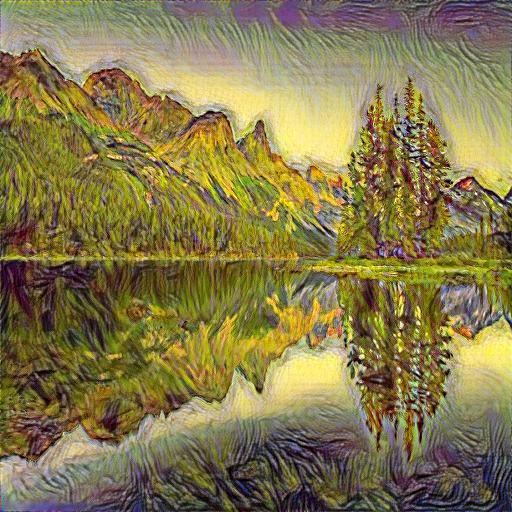

# Neural Style Transfer with High-Resolution Upscaling (RRDB, PyTorch)

This project applies **Neural Style Transfer (NST)** to input images and then enhances the resolution using **Real-ESRGAN RRDB models** (PyTorch-based). The final output is a high-quality, stylized image suitable for large-format use.

***

## 🚀 Key Features

- Consistent **style transfer** using a reference style image.
- High-quality **image upscaling** using Real-ESRGAN RRDB model (`realesrgan-x4plus.pth`).
- Complete **PyTorch-based pipeline** — no Vulkan binaries required.
- Compatible with **macOS (CPU)** and Linux.

***

## 📁 Project Structure
<pre>
nst_upscale_env/
│
├── style_transfer/
│   ├── nst_model.py         # PyTorch code for NST
│   ├── utils.py             # Preprocessing and helpers
│   ├── content.jpg          # Original input image
│   ├── style.jpg            # Artistic style reference
│   └── stylized_output.jpg  # NST output
│
├── upscaling/
│   ├── realesrgan/                  # Cloned Real-ESRGAN repo (PyTorch)
│   ├── upscaler.py                  # Script to run the upscaler
│   └── weights/
│       └── RealESRGAN_x4plus.pth    # Pretrained RRDB model
│
├── requirements.txt
├── README.md
└── .gitignore
</pre>

***

## 🧱 Setup Instructions

### 1. Create and Activate Virtual Environment

`python3 -m venv nst_upscale_env`

`source nst_upscale_env/bin/activate`

### 2. Clone This Repository

`git clone https://github.com/<your-username>/NST_Upscale.git`

`cd NST_Upscale`

### 3. Install Dependencies

`pip install -r requirements.txt`

### 🎨 Step 1: Run Neural Style Transfer

`cd style_transfer`

`python NST.ipynb` #nst.py

	•	This script will read content.jpg and style.jpg, then save the output as stylized_output.jpg.

### 🔼 Step 2: Upscale the Stylized Image

Download Weights (if not already):

Download the RealESRGAN_x4plus.pth model from the official repo:
`https://github.com/xinntao/Real-ESRGAN#model-zoo`

Place it inside:

`upscaling/realesrgan/weights/`

Run Upscaler:

`cd upscaling`

`python upscaler.py --input ../style_transfer/stylized_output.jpg --output output_4k.png --scale 4`

	•	Output image will be saved as output_4k.png.
	•	You can change the --scale to upscale by 2, 4, or 8 as per the model.

***

## 🖼️ Screenshots

### Input

**Content Image**  

**Style Image**  

### Output

**Stylized Output (512x512)**  

**Upscaled to 4K**  

***

⚠️ Notes
	•	Ensure content and style images are of compatible sizes. The script resizes them automatically to 512x512 before NST.
	•	Real-ESRGAN uses the RRDB-based ESRGAN model for super-resolution.
	•	PyTorch CPU-only execution can be slower. GPU acceleration requires CUDA (not available on macOS by default).

***

📘 References
	•	Neural Style Transfer — PyTorch Tutorial
	•	Real-ESRGAN Repository

***

👤 Author

Raghunandan M S 
Data Scientist | AI Enthusiast 
GitHub: github.com/
